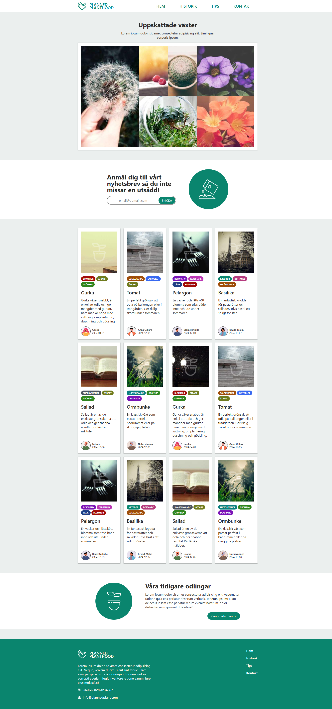

# Planned Planthood - HTML/CSS template replication

A recreation of a webpage design template using only HTML and CSS.

## Overview
This project is a frontend exercise to accurately recreate the visual layout and styling of the given template, using only HTML for structure and CSS for presentation.



## Technologies Used

* HTML5
* CSS3

## How to View

1. Clone this repository:
```bash
git clone https://github.com/jplimmer/planned-planthood.git
```

2. Open `index.html` in your browser.

## Project Structure
```
├── index.html
├── styles/
|   ├── reset.css
│   └── styles.css
├── assets/
│   └── images/
│       └── (image assets)
│   └── icons/
│       └── (icon assets)
│   └── avatars/
│       └── (avatar assets)
├── design/
│   └── (template designs)
└── README.md (this file)
```